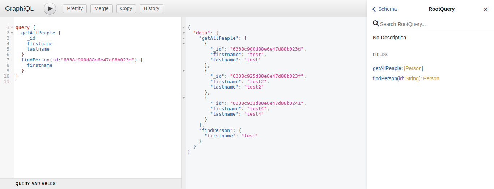
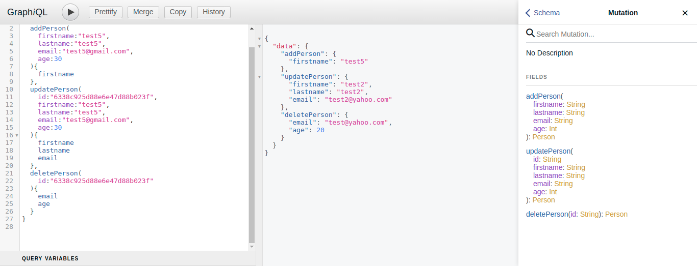

# express-graphql-api

#### CRUD API with Express GraphQL

Project in Action - [ExpressGraphGLAPI](https://expressgraphql-api.herokuapp.com/graphql)

#### Run The App Locally

```sh
npm run install
npm run dev
```

- visit url http://localhost:5000/graphql

- Query


- Mutation
